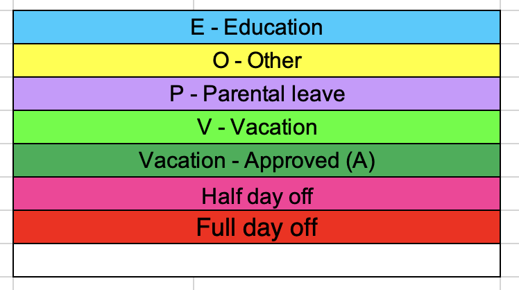

# Vacation list generator
This code generates Excel based vacation list for employees at an organisation (team, department, company) to enter their vacations, day off, leave of absence, etc.

## Limitation

The Sweden holiday calendar is used by default. There is currently no support to change to other countries but please make a feature request if needed.

## How to use vacation list
By default, a vacation list has 3 tabs in which a tab is correponding to 4 months period.
(This can be configured in later version)

`David`, an imaginary employee working at `Backend team` starts at `Names+Teams - Enter here` tab to enter his name and team. This step can be done by manager at begining of a year.


There are certain colors used in vacation list. For examples:
* <span style="background-color: #ccc;color: black">Sat</span> and <span style="background-color: #ccc;color: black">Sun</span> as weekend.
* <span style="background-color: #FF0000;">Wed</span> indicates that Wednesday is a public holiday.
* Half working day (not public holiday) is marked as pink
* <span style="background-color: #00ff00;">V</span> or <span style="background-color: #00ff00;">v</span> indicate that this is a vacation day.
* <span style="background-color: #006400;">A</span> or <span style="background-color: #006400;">a</span> indicate that this is an approved vacation day by manager.
* <span style="background-color: #0000ff;">E</span> or <span style="background-color: #0000ff;">e</span> indicate that an employee takes off for education.
* <span style="background-color: #800080;">P</span> or <span style="background-color: #800080;">p</span> indicate that an employee takes off for parental leave.

* Other reason (<span style="background-color: #ffff00;">O</span> or <span style="background-color: #ffff00;">o</span> ) is marked as **yellow** 



Now, `David` can enter his day off through out the year.


# How to generate vacation list generator
## Installation
````
$ python3 -m venv env
$ source env/bin/activate
$ pip install -r requirements.txt

````
## Run

Generate vacation list for 2025 by

````
$ python main 2025

````
The `2024-vacationlist.xlsx` will be outputed under `output` folder.
